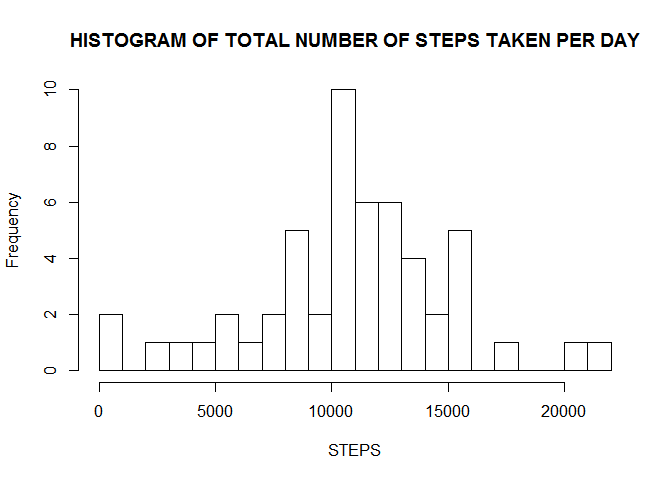
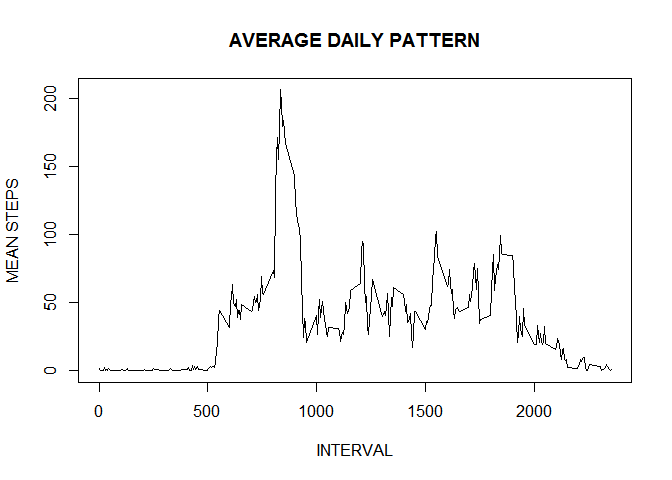
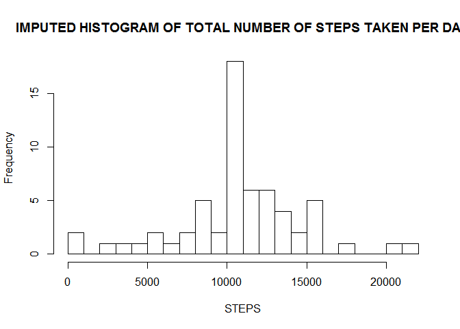
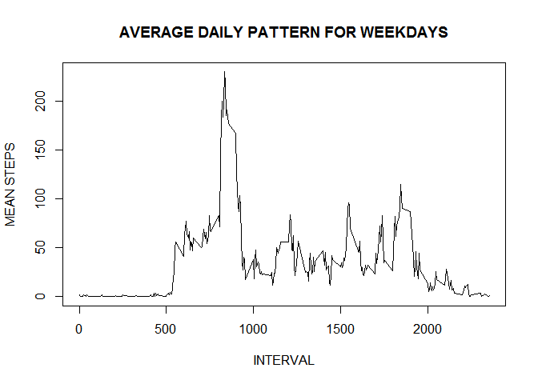
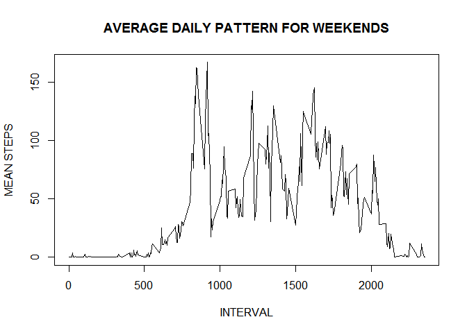

# Reproducible Research: Peer Assessment 1


## Loading and preprocessing the data

```r
act_d <- read.csv("activity.csv")
summary(act_d)
```

```
##      steps                date          interval     
##  Min.   :  0.00   2012-10-01:  288   Min.   :   0.0  
##  1st Qu.:  0.00   2012-10-02:  288   1st Qu.: 588.8  
##  Median :  0.00   2012-10-03:  288   Median :1177.5  
##  Mean   : 37.38   2012-10-04:  288   Mean   :1177.5  
##  3rd Qu.: 12.00   2012-10-05:  288   3rd Qu.:1766.2  
##  Max.   :806.00   2012-10-06:  288   Max.   :2355.0  
##  NA's   :2304     (Other)   :15840
```

```r
str(act_d)
```

```
## 'data.frame':	17568 obs. of  3 variables:
##  $ steps   : int  NA NA NA NA NA NA NA NA NA NA ...
##  $ date    : Factor w/ 61 levels "2012-10-01","2012-10-02",..: 1 1 1 1 1 1 1 1 1 1 ...
##  $ interval: int  0 5 10 15 20 25 30 35 40 45 ...
```

```r
act_d$date <- as.Date(act_d$date, format = "%Y-%m-%d")
cc <- complete.cases(act_d)
cc_act_d <- act_d[cc,]
dim(cc_act_d)
```

```
## [1] 15264     3
```

## What is mean total number of steps taken per day?

```r
s_day <- aggregate(steps ~ date, data= cc_act_d, sum)
hist(s_day$steps, breaks = 20, xlab = "STEPS", main = "HISTOGRAM OF TOTAL NUMBER OF STEPS TAKEN PER DAY")
```



MEAN NUMBER OF STEPS TAKEN PER DAY


```r
mean(s_day$steps)
```

```
## [1] 10766.19
```

MEDIAN NUMBER OF STPES TAKEN PER DAY


```r
median(s_day$steps)
```

```
## [1] 10765
```

## What is the average daily activity pattern?

```r
s_interval <- aggregate(steps ~ interval, data= cc_act_d, mean)
plot(s_interval$interval, s_interval$steps, type = "l", xlab = "INTERVAL", ylab="MEAN STEPS", main = "AVERAGE DAILY PATTERN")
```



MAXIMUM NUMBER OF AVERAGE sTEPS


```r
max(s_interval$steps)
```

```
## [1] 206.1698
```

INTERVAL FOR WHICH MAXIMUM NUMBER OF STEPS ARE TAKEN


```r
s_interval[which.max(s_interval$steps),]$interval
```

```
## [1] 835
```

## Imputing missing values

NUMBER OF MISSING ENTRIES


```r
sum(is.na(act_d$steps))
```

```
## [1] 2304
```

We replace missing values in an interval by mean of valid values in that interval for other days as below


```r
complete_act_d <- act_d
index_NA <- which(is.na(act_d$steps))
complete_act_d[index_NA, ]$steps <- unlist(lapply(index_NA, FUN= function(index_NA) { s_interval[act_d[index_NA,]$interval == s_interval$interval,]$steps }))
```

ANALYSIS OF IMPUTED DATA


```r
s_complete_day <- aggregate(steps ~ date, data= complete_act_d, sum)
hist(s_complete_day$steps, breaks = 20, xlab = "STEPS", main = "IMPUTED HISTOGRAM OF TOTAL NUMBER OF STEPS TAKEN PER DAY")
```



MEAN NUMBER OF STEPS TAKEN PER DAY


```r
mean(s_complete_day$steps)
```

```
## [1] 10766.19
```

MEDIAN NUMBER OF STPES TAKEN PER DAY


```r
median(s_complete_day$steps)
```

```
## [1] 10766.19
```


## Are there differences in activity patterns between weekdays and weekends?

```r
complete_act_d$type_day <- ifelse(weekdays(complete_act_d$date) %in% c("Saturday", "Sunday"), "weekend", "weekday")
weekend_act_d <- complete_act_d[complete_act_d$type_day == "weekend",]
weekday_act_d <- complete_act_d[! complete_act_d$type_day == "weekend",]
weekend_act_interval <- aggregate(steps ~ interval, data = weekend_act_d, mean)
weekday_act_interval <- aggregate(steps ~ interval, data = weekday_act_d, mean)
plot(weekday_act_interval$interval, weekday_act_interval$steps, type = "l", xlab = "INTERVAL", ylab="MEAN STEPS", main = "AVERAGE DAILY PATTERN FOR WEEKDAYS")
```



```r
plot(weekend_act_interval$interval, weekend_act_interval$steps, type = "l", xlab = "INTERVAL", ylab="MEAN STEPS", main = "AVERAGE DAILY PATTERN FOR WEEKENDS")
```



During weekdays, activity peak is in morning, while in weekends show high level of activity in days also.
